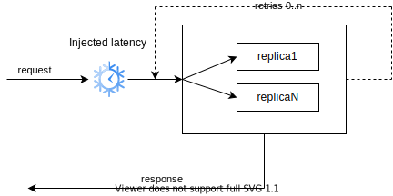
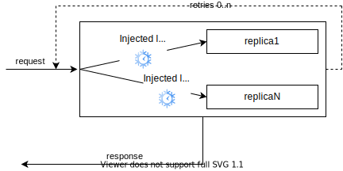

# ClusterClient.Chaos

The library for practicing [chaos engineering](https://principlesofchaos.org/) using [Vostok.ClusterClient](https://github.com/vostok/clusterclient.core "Vostok.ClusterClient") as base http  client.

Heavily inspired by [Netflix Chaos Monkey](https://github.com/Netflix/chaosmonkey) and [Simmy](https://github.com/Polly-Contrib/Simmy) projects.

## Latency injection

For now this library provide an API to inject the specified additional latency for the http request with specified rate. 
Using this injection you can observe your system behavior in moments of requests` execution time random increasings. 
The reasons for such extra long requests' latencies could be network problems or target request handling server's problems.

### Usage

To configure latency injection use `ClusterClientConfiguration`'s extension methods as follows:
```c#
var client = new ClusterClient(new SilentLog(), configuration =>
            {
                configuration.InjectTotalLatency(() => TimeSpan.FromSeconds(1), () => 0.05); //adds extra 1 second latency with 5% probability
            });
```
Methods parameters are:

`latencyProvider` - function to get desired `Timespan` for the injected latency

`rateProvider` - function to provide desired probability rate of the latency injection. 
0.0 - never inject latency, 1.0 - always inject latency for the request.

There are overloads with `ILatencyPerformer` parameter, so you can implement your own class for the injection decision based on specified rate and impelement your own "sleep" functionality to introduce extra latency for your requests.

There are three ways to configure latency injection using `ClusterClient.Chaos`:
- **[Inject total latency](#total-latency)**
- **[Inject every call retry latency](#every-retry-latency)**
- **[Inject every network call latency]()**

#### Total latency
With this configuration the latency is injected at the beginning of the request's pipeline
ignoring any retries or different strategies calls.

Usage example:
```c#
configuration.InjectTotalLatency(() => TimeSpan.FromSeconds(1), () => 0.05);
```
*Scheme*



#### Every retry latency
This configuration injects latency for every request retry. Request retry policy is configured with ClisterClients's `RetryPolicy`

Usage example:
```c#
configuration.InjectLatencyOnEveryRetry(() => TimeSpan.FromSeconds(1), () => 0.05);
```

*Scheme*


#### Every network call latency

Using this configuration you can inject latency on every network call, which is implemented by ClusterClient's 
`IRequestSender.SendToReplicaAsync`

Usage example:
```c#
configuration.InjectLatencyOnEveryNetworkCall(() => TimeSpan.FromSeconds(1), () => 0.05);
```

*Scheme*



## Example

ClusterClient.Chaos and chaos testing example can be found [at this test](Example.ChaosTesting/LatencyTests.cs) with detailed explanation in [docs]().

[comment]: # (todo docs)

### Blog post

[Chaos testing with Vostok.ClusterClient]() - by Andrey Shumeev

[comment]: # (todo article and link)